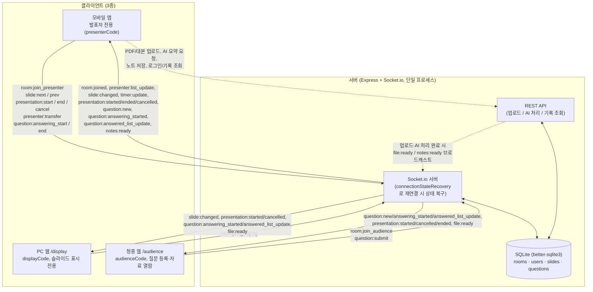
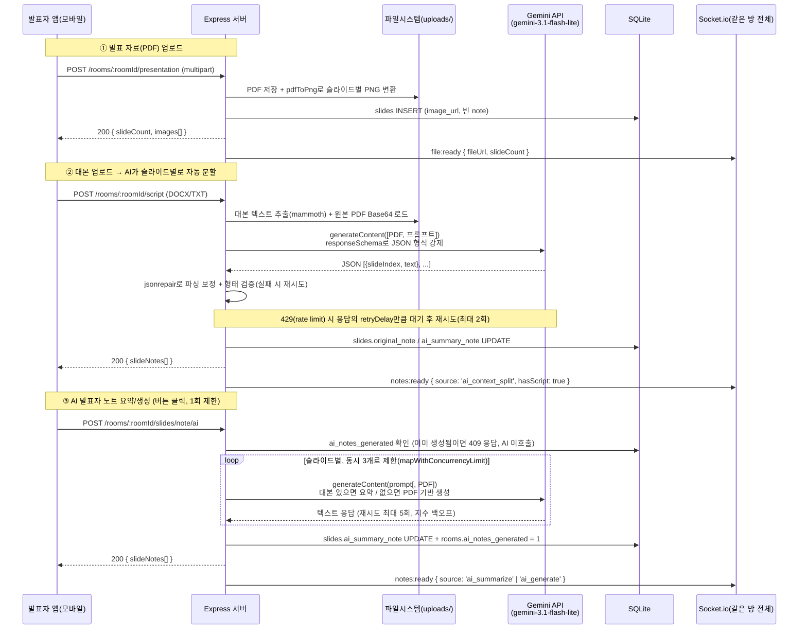

# 26s-w2-c3-03

## 공통과제 II : 협업형 실전 산출물 제작 (2인 1팀)

**목적:** 실시간 인터랙션, LLM Wrapper, Cross-Platform 중 하나의 옵션을 선택해 구현하며, 선택한 기술을 실제로 동작하는 형태의 산출물로 완성한다.

**선택 옵션:**

| 옵션 | 설명 |
|---|---|
| 실시간 인터랙션 | 사용자 간 상태 변화, 실시간 데이터 흐름, 스트리밍 응답 등 실시간성이 드러나는 기능을 구현 |
| LLM Wrapper | LLM API를 활용하여 AI 기능이 포함된 산출물을 구현 |
| Cross-Platform | 하나의 산출물을 여러 실행 환경에서 사용할 수 있도록 구현* |

> *데스크톱 앱 ↔ 모바일 앱; 혹은 다른 폼팩터에서의 앱; 웹만/웹 기반 프레임워크(Electron, Tauri 등) 대신 다른 프레임워크를 시도해보는 것을 적극 권장

**결과물:** 선택한 옵션이 적용된 작동 가능한 산출물, 실행 가능한 코드, 시연 자료 및 관련 문서

---

## 팀원

| 이름 | 학교 | GitHub | 역할 |
|---|---|---|---|
| 김민 | 이화여자대학교 | https://github.com/7immin | 백엔드 |
| 김규민 | KAIST | https://github.com/rbalskim | 프론트엔드 |

---

## 선택 옵션

- [x] 실시간 인터랙션
- [x] LLM Wrapper
- [ ] Cross-Platform

---

## 기획안

- **산출물 주제:** 발표 도우미 앱 **Kit (Keep it together)**
- **제작 목적:** 발표는 자료 준비, 대본 암기, 시간 관리, 청중 질문 응대까지 한 사람이 동시에 처리해야 할 게 많은데, 정작 이걸 도와주는 도구는 파편화되어 있다. Kit는 이 흐름을 하나로 묶어서, **발표자가 스마트폰 하나로 슬라이드 제어·발표자 노트 확인·실시간 질문 응대까지 전부 처리**할 수 있게 만드는 걸 목표로 한다. 동시에 청중도 QR 코드 하나로 접속해 발표 자료를 직접 넘겨보고 질문을 편하게 등록할 수 있게 해서, **발표라는 행위 전체를 발표자·PC 화면·청중이 실시간으로 공유하는 하나의 경험**으로 만드는 게 이 서비스의 존재 이유이다.
- **선택 옵션:** 실시간 인터랙션 & LLM Wrapper
- **핵심 구현 요소:**

    **[모바일 앱] - 발표자 사용**
    - 회원가입 및 로그인
    - 발표 방 생성
    - 이전 발표 기록 저장
        - 발표마다 사용했던 발표 자료, 대본, 발표자 노트, 답변한 질문, 총 발표 시간, 발표자 리스트 저장
        - 발표 기록을 누르면 해당 발표 자료로 다시 발표하기 가능
    - 발표 방
        - 발표 자료 및 발표 업로드
            - 대본 업로드 시 자동으로 슬라이드 별 대본 내용 분리하여 발표자 노트 생성
        - AI 요약
            - 대본을 업로드하면 대본 내용을 바탕으로 키워드 중심 요약
            - 대본을 업로드하지 않으면 발표 자료 내용을 바탕으로 발표자 노트 생성
        - 노트 수정
            - 발표 자료 및 발표자 노트를 슬라이드별로 넘겨볼 수 있음
            - 발표자 노트 수정
        - 발표 시간, 질문의 익명 여부, 발표 중에 질문을 받을지 여부 설정
    - 발표 화면
        - 슬라이드 이전/다음 버튼
            - 모바일 앱에서는 발표자 노트도 해당 슬라이드에 맞게 변경
            - PC 웹페이지의 슬라이드도 동기화
        - 현재 남은 발표 시간 및 초과한 시간 표시
        - 발표자 교체
        - 발표 종료
    - 질문 화면
        - 받은 질문 목록
            - 발표자가 답변할 질문 선택 시 답변하기 버튼 활성화
        - 답변하기
            - 답변하기 버튼을 누르면 선택한 질문이 PC 및 청중용 웹페이지에 표시
        - 답변 종료하기
            - 답변 종료하기 버튼을 누르면 선택한 질문은 답변한 질문 목록으로 이동
        - 답변한 질문 목록은 답변한 순서대로 정렬

    **[웹페이지 1] - PC 사용**
    - 대기 화면
        - 청중이 들어올 수 있는 QR 코드 및 청중 입장 코드 생성과 동시에 코드들이 띄워진 화면 표시
        - 발표자가 모바일 앱에서 발표 시작 버튼을 누르면 발표자가 업로드한 발표 자료 화면 표시
    - 발표 자료 화면
        - 발표자가 제어하는 대로 슬라이드 동기화
    - 발표 종료 후 발표자가 답변 시 발표자가 선택한 질문 화면에 표시

    **[웹페이지 2] - 청중 사용**
    - PC에 띄워진 QR 코드로 접속
    - 발표 화면
        - 발표자가 제어하는 화면과 관계없이 청중이 각자 슬라이드 확인 가능
        - 질문 등록
  
- **사용 / 시연 시나리오:**
  - **지훈 - 슬라이드 넘길 때마다 컴퓨터 앞으로 되돌아가야 하는 발표자**
    - 상황: 혼자 발표하든 팀으로 발표하든, 발표자는 청중 앞에서 움직이며 말하고 싶은데 슬라이드를 넘기려면 매번 컴퓨터 앞으로 다시 가야 함
    - Pain Point: 화면 앞을 벗어나기 어려우니 계속 컴퓨터 옆에 붙어있게 되고, 발표에 자연스러운 동선이나 제스처를 쓰기 힘듦. 게다가 발표 중간에 지금 슬라이드에서 무슨 말을 하려 했는지 순간 까먹거나, 시간이 얼마나 지났는지 몰라서 뒷부분에서 급하게 말이 빨라지는 문제도 자주 생김
    - 원하는 것: 컴퓨터 앞을 벗어나 자유롭게 움직이면서도 **자기 폰으로 슬라이드를 직접 넘기고**, 폰 화면엔 **지금 슬라이드용 발표 노트**랑 **남은 시간 타이머**가 같이 떠서 흐름도 안 끊기고 시간 감각도 유지되는 것
      → 리모컨 + 발표 노트 + 타이머 기능의 핵심 사용자
      
  - **유나 - 소심하지만 궁금한 게 많은 청중**
    - 상황: 발표 끝나고 Q&A 시간. 궁금한 게 몇 개 있지만, 질문하려면 손 들고 마이크 받아서 다들 쳐다보는 앞에서 말해야 함
    - Pain Point: 사람들 앞에서 마이크 들고 이야기하는 것 자체가 부담. "이런 것도 모르나" 싶을까봐 걱정도 되고, 막상 말하려면 무슨 말부터 해야 할지 정리도 안 됨. 결국 궁금해도 참고 넘어가는 경우가 대부분
    - 원하는 것: 마이크 들 필요 없이 **폰으로 텍스트만 남기면 질문이 전달**되는 것. 발표자가 질문 리스트를 보고 시간 봐가며 중요한 것만 골라 답해주니, 자기 질문이 채택 안 되더라도 부담 없이 남길 수 있음
      → 텍스트 질문 제출 + 발표자용 질문 리스트 기능의 핵심 사용자

  - **재현 - 발표장 컴퓨터에 미리 파일을 올려둬야 하는 다음 발표자**
    - 상황: 세미나실이나 강의실에 있는 공용 컴퓨터로 발표가 진행됨. 자기 차례가 되기 전에 미리 발표장 컴퓨터로 가서 USB나 이메일, 드라이브로 자기 파일을 옮겨놔야 함
    - Pain Point: 발표 시작 전에 한 명씩 순서대로 컴퓨터 앞에 가서 파일 옮기는 시간이 걸리고, 앞사람 발표 도중에 옮기려면 눈치가 보임. 옮겨놓고 나서도 "혹시 파일 잘못 옮겼나", "발표 중에 순서 꼬이면 어떡하지" 하는 신경이 쓰임. 파일을 안 가져왔거나 USB가 안 되면 그 자리에서 이메일 뒤지느라 시간이 지연됨
    - 원하는 것: 발표장 컴퓨터 앞에 갈 필요 없이 **자기 자리에서 미리 앱에 파일을 올려두고**, 자기 차례가 되면 **권한만 넘겨받아도 발표장 컴퓨터 화면이 자동으로 자기 파일로 전환**되는 것. 미리 줄 서서 옮기는 과정 자체가 사라짐
      → 파일 사전 업로드 + 권한 이양 시 자동 전환 기능의 핵심 사용자

- **팀원별 역할:**
  - 김민: 백엔드
  - 김규민: 프론트엔드

### 개발 일정

| 날짜 | 목표 |
|---|---|
| Day 1 | 주제 선정 |
| Day 2 | 기획안 초안 작성, 역할 분담, DB 스키마 초안 작성, Expo 앱 연결 |
| Day 3 | - 프론트: 앱 UI 설계, 발표 준비 화면 구현<br> - 백: ERD 초안 설계, PC 및 청중 입장 기능 구현, 슬라이드 넘기기 및 타이머 기능 구현<br> - 프론트 백 연결 테스트 |
| Day 4 | - 프론트: 발표 시작 화면 구현<br>- 백: 질문 정렬, 답변할 질문 선택 기능, 발표 자료 및 대본 업로드 기능 구현 |
| Day 5 | - 프론트: 노트 수정 화면, 질문 목록 화면 구현<br>- 백: PDF 파일 이미지 변환, 대본 분할, AI 요약 기능 구현<br>- 프론트 백 연결 테스트 |
| Day 6 | - 프론트: 회원가입 및 로그인 화면 구현, 전체적인 앱 UI 버그 수정<br>- 백: 회원가입 및 로그인 기능 구현, AI 요약 프롬프트 수정, 전체적인 백엔드 버그 수정<br>- 프론트 백 연결 테스트<br>- 발표자용 모바일 앱 E2E 테스트 |
| Day 7 | 웹페이지 UI 수정, 배포, 문서 작업 |

---

## 구현 명세서

| 구현 요소 | 설명 | 우선순위 |
|---|---|---|
| [모바일 앱] 회원가입 및 로그인 | 계정 생성·인증, 방 생성/발표 기록 소유권의 기반 | 필수 |
| [모바일 앱] 발표 방 생성 | 방 코드 발급의 시작점 | 필수 |
| [모바일 앱] 발표 자료 업로드 | 자료 없이는 발표 자체가 성립 안 됨 | 필수 |
| [모바일 앱] 노트 수정 | 슬라이드별 자료·노트 열람 및 발표자 노트 직접 편집 | 필수 |
| [모바일 앱] 슬라이드 이전/다음 버튼 | 현재 슬라이드 전환 시 모바일 노트도 함께 갱신 | 필수 |
| [모바일 앱] PC 화면 슬라이드 동기화 | 발표자 조작을 PC 웹페이지에 실시간 반영 | 필수 |
| [모바일 앱] 발표 종료 | 발표 세션 종료 및 기록 확정 처리 | 필수 |
| [모바일 앱] 질문 목록 조회·답변 대상 선택 | 받은 질문 확인, 선택 시 답변하기 버튼 활성화 | 필수 |
| [모바일 앱] 답변하기 | 선택한 질문을 PC·청중 화면에 표시 | 필수 |
| [모바일 앱] 답변 종료하기 | 답변 완료 질문을 답변한 목록으로 이동 | 필수 |
| [PC 웹페이지] 대기 화면 | QR 코드·청중 입장 코드 생성 및 표시 | 필수 |
| [PC 웹페이지] 발표 시작 시 화면 전환 | 발표 시작 시 업로드된 자료 화면으로 전환 | 필수 |
| [PC 웹페이지] 슬라이드 동기화 표시 | 발표자 제어에 따른 슬라이드 화면 반영 | 필수 |
| [PC 웹페이지] 답변 질문 화면 표시 | 발표자가 선택·답변한 질문을 화면에 노출 | 필수 |
| [청중 웹페이지] QR 접속 | PC 화면의 QR로 청중용 웹페이지 진입 | 필수 |
| [청중 웹페이지] 질문 등록 | 청중이 질문을 작성·제출 | 필수 |
| [모바일 앱] 대본 업로드 시 노트 자동 분리 | 대본을 슬라이드별로 자동 매칭해 노트 생성 | 선택 |
| [모바일 앱] AI 요약(대본 기반) | 업로드한 대본을 키워드 중심으로 요약 | 선택 |
| [모바일 앱] AI 요약(자료 기반) | 대본 미업로드 시 발표 자료 기반 노트 자동 생성 | 선택 |
| [모바일 앱] 발표 설정 커스터마이징 | 발표 시간·질문 익명 여부·실시간 질문 허용 여부 설정 | 선택 |
| [모바일 앱] 남은/초과 시간 표시 | 발표 화면에 실시간 카운트다운·초과 시간 노출 | 선택 |
| [모바일 앱] 발표자 교체 | 슬라이드 제어권을 다른 발표자에게 이전 | 선택 |
| [모바일 앱] 답변한 질문 정렬 | 답변한 질문 목록을 답변 순서대로 정렬 | 선택 |
| [모바일 앱] 이전 발표 기록 저장 | 자료·대본·노트·답변 질문·총 시간·발표자 리스트 보관 | 선택 |
| [모바일 앱] 기록으로 재발표하기 | 저장된 기록을 눌러 동일 자료로 재발표 시작 | 선택 |
| [청중 웹페이지] 독립적 슬라이드 탐색 | 발표자 화면과 무관하게 청중이 각자 슬라이드 탐색 | 선택 |

---

## 아키텍처

> 실시간 인터랙션은 **Socket.io(WebSocket) 단일 채널만 사용**
> LLM Wrapper는 Google Gemini(`@google/generative-ai`)를 REST 방식으로 감싸 호출

### 실시간 인터랙션: WebSocket(Socket.io) 구조도



- 방(room) 단위로 `socket.join(roomId)`하여 같은 발표에 속한 클라이언트끼리만 이벤트를 주고받는다(`io.to(roomId).emit(...)`).
- 소켓 이벤트는 "실시간성이 필요한 것"(슬라이드 이동, 타이머, 질문 상태 변경)에만 쓰고, 파일 업로드·AI 처리·기록 조회처럼 무거운/멱등적인 작업은 REST로 분리되어 있다. REST 처리가 끝나면 서버가 같은 방에 소켓 이벤트(`file:ready`, `notes:ready`)를 추가로 쏴서 다른 클라이언트 화면도 동기화한다.
- 재연결 시 클라이언트가 로컬에 저장해둔 고정 `userId`를 다시 실어보내면, 서버는 새 소켓 ID만 갱신하고 기존 신원(발표 제어권 등)을 그대로 유지한다.

### LLM Wrapper: API 연동 흐름도 (Gemini)



- Gemini 무료 티어의 분당 요청 제한(약 15회) 때문에, 슬라이드 여러 장을 한꺼번에 `Promise.all`로 호출하지 않고 `mapWithConcurrencyLimit`로 동시 처리 수를 제한한다.
- JSON 응답은 `responseSchema`로 형식을 강제하고, 그래도 깨진 응답이 오면 `jsonrepair`로 보정 후 형태를 검증한다 — 실패 시 지수 백오프(또는 Gemini가 알려준 `retryDelay`)로 재시도.
- AI 노트 생성은 `rooms.ai_notes_generated` 플래그로 같은 대본 기준 중복 호출을 막고, 새 대본이 업로드되면 이 플래그가 초기화되어 재생성이 가능해진다.

---

## 설계 문서

> 프로젝트 성격에 따라 필요한 항목만 작성

### 화면 / 인터페이스 설계

<!-- Figma 링크, 화면 이미지, CLI 사용 예시, 앱 화면 등 -->

### 데이터 구조

<!-- DB 스키마, JSON 구조, 파일 저장 방식 등 -->
**KIT 서비스 ERD**


### API / 외부 서비스 연동

| Method / 방식 | Endpoint / 서비스 | 설명 | 요청 | 응답 |
|---|---|---|---|---|
| POST | `/auth/signup` | 회원가입. 비밀번호는 영문+숫자+특수문자 8~12자 정규식 검증, bcrypt 해시 저장 | `{ email, password, name }` | `{ success, token, accountId, name }` |
| POST | `/auth/login` | 로그인. JWT 30일 만료 | `{ email, password }` | `{ success, token, accountId, name }` |
| GET | `/auth/me` | 로그인 토큰 유효성 확인. 새로고침 시 로그인 상태 복구용 | Header `Authorization: Bearer <token>` | `{ success, accountId, name }` |
| POST | `/rooms/:roomId/presentation` | 발표 자료(PDF) 업로드 → 슬라이드 이미지 변환. `pdf-to-png-converter`로 페이지별 PNG 생성 + DB 저장, 완료 시 소켓 `file:ready` 브로드캐스트 | multipart `presentationFile`(PDF), `ownerId` | `{ success, slideCount, fileUrl, images[] }` |
| POST | `/rooms/:roomId/script` | 대본 업로드 → AI가 슬라이드별로 자동 분할. `mammoth`로 텍스트 추출 후 Gemini 호출(아래 외부 서비스 참고), 완료 시 `notes:ready` 브로드캐스트 | multipart `scriptFile`(DOCX/TXT) | `{ success, slideCount, slideNotes[] }` |
| POST | `/rooms/:roomId/slides/note/ai` | AI 발표자 노트 요약/생성. 대본 있으면 요약, 없으면 PDF 기반 생성. 슬라이드당 Gemini 1회 호출(동시 3개로 제한), `rooms.ai_notes_generated`로 같은 대본 기준 중복 호출 차단 | (body 없음, `roomId`만 사용) | `{ success, slideNotes[] }` / 409(이미 생성됨) |
| PUT | `/rooms/:roomId/slides/:slideIndex/note` | 발표자 노트 수동 수정. 같은 방의 다른 발표자에게 `note:saved` 브로드캐스트 | `{ newNote, editedByName }` | `{ success }` |
| GET | `/rooms/:roomId` | 방 현재 상태 조회. 재연결·늦은 입장 시 소켓 이벤트를 놓쳤을 때 상태 복구용. 접속 코드(presenter/display/audience code)는 내려주지 않음 | - | `{ success, room: {...} }` |
| GET | `/rooms/:roomId/slides` | 슬라이드 + 노트 목록 조회. 노트 수정 화면 등 늦게 입장한 클라이언트의 초기 로딩용 | - | `{ success, slides[] }` |
| GET | `/rooms/:roomId/questions` | 질문 목록 조회. 완료된 질문은 `completed_at`, 나머지는 `created_at` 기준 정렬 | - | `{ success, questions[] }` |
| GET | `/accounts/me/rooms` | 로그인 계정의 이전 발표 기록 목록. 방장뿐 아니라 참여 발표자로 들어갔던 방도 포함, 계정이 숨긴 기록은 제외 | Header `Authorization` | `{ success, rooms[] }` |
| DELETE | `/rooms/:roomId/history` | 발표 기록 삭제. 실제 방/자료는 지우지 않고 요청 계정의 목록에서만 숨김 처리 | Header `Authorization` | `{ success }` |
| GET | `/rooms/:roomId/history` | 발표 기록 상세 조회. 슬라이드/노트/답변한 질문/발표자 목록 포함. "다시 발표하기"(`room:create_from_history`)의 원본 데이터로도 재사용 | Header `Authorization` | `{ success, history: {...} }` |
| GET (static) | `/files/:filename` | 업로드 파일(발표자료 PDF, 슬라이드 PNG, 대본) 서빙. `express.static(UPLOAD_DIR)` | - | 파일 바이너리 |
| WebSocket | Socket.io 이벤트 전체 | 방 입장, 슬라이드 제어, 타이머, 질문 등 실시간 동기화. 이벤트 목록·payload는 `shared/events.js` 및 위 [WebSocket 구조도](#실시간-인터랙션-websocketsocketio-구조도) 참고 | — | — |
| REST (외부) | Google Gemini API — `generateContent` (`@google/generative-ai`, model `gemini-3.1-flash-lite`) | 대본→슬라이드 매칭, 발표자 노트 요약/생성. 429(rate limit) 시 응답의 `retryDelay`만큼 대기 후 재시도, 응답이 깨지면 `jsonrepair`로 보정. 자세한 흐름은 위 [API 연동 흐름도](#llm-wrapper-api-연동-흐름도-gemini) 참고 | 프롬프트 텍스트(+PDF Base64 첨부 가능), JSON 응답 시 `responseSchema`로 형식 강제 | 텍스트 또는 스키마 강제 JSON |

---

## 산출물 및 실행 방법

- **산출물 설명:** 발표자 전용 모바일 앱(Expo/React Native), PC 디스플레이용 웹페이지, 청중 참여용 웹페이지 3개 클라이언트로 구성된 발표 보조 서비스. 발표자는 폰 하나로 슬라이드 제어·발표자 노트·타이머·질문 응답까지 처리하고, PC와 청중 화면은 Socket.io로 실시간 동기화된다.
- **실행 환경:** 모바일 앱은 Expo Go 또는 EAS Build로 생성한 APK로 실행(Android/iOS), 웹 2종은 브라우저에서 바로 접속, 백엔드는 Node.js 서버(Railway 배포).
- **실행 방법:** 아래 [실행 방법](#실행-방법) 참고. 배포된 버전은 웹은 Vercel, 서버는 Railway, 모바일 앱은 EAS Build로 만든 APK로 배포되어 있다.
- **시연 영상 / 이미지:** (선택)

### 실행 방법

레포는 `mobile`(Expo 앱) · `web`(청중/PC 웹) · `server`(Express + Socket.io) 3개 워크스페이스로 구성되어 있어, 각 폴더에서 따로 의존성을 설치하고 실행해야 한다.

```bash
# 1) 서버 (server/)
cd server
npm install
# .env에 GEMINI_API_KEY, JWT_SECRET 설정
npm run dev          # nodemon으로 실행, 기본 포트 4000

# 2) 웹 (web/) — PC 디스플레이 화면 + 청중 화면
cd web
npm install
npm run dev           # Vite 개발 서버

# 3) 모바일 앱 (mobile/) — 발표자용
cd mobile
npm install
npm run start          # Expo 개발 서버, Expo Go 앱으로 QR 스캔해 접속
# 배포용 APK가 필요하면:
# eas build --platform android --profile preview
```

> 로컬 개발 시 `web/src/lib/socket.js`, `mobile/lib/socket.ts`의 서버 주소가 배포된 Railway 주소로 고정되어 있으므로, 로컬 서버로 붙이려면 해당 주소를 `http://localhost:4000`으로 바꿔야 한다.

### 기술 구성

| 분류 | 사용 기술 |
|---|---|
| 핵심 기술 | Node.js + Express 5(REST API), Socket.io 4(실시간 통신) · React 19 + Vite(PC/청중 웹) · React Native + Expo SDK 54(모바일 앱) |
| 실행 환경 | 서버: Node.js(Railway) · 웹: 브라우저 · 모바일: Expo |
| 데이터 저장 | SQLite(`better-sqlite3`), Railway Volume |
| 외부 API / 서비스 | Google Gemini API(`@google/generative-ai`, `gemini-3.1-flash-lite`) · Railway(백엔드 배포) |
| 기타 | 인증: `jsonwebtoken`(JWT) + `bcrypt`(비밀번호 해시) · 업로드: `multer`, `pdf-to-png-converter`, `mammoth`(DOCX 파싱) · QR 코드 생성: `qrcode.react` · 라우팅: `react-router-dom` / `expo-router` |

---

## 회고 문서

> [KPT 방법론 참고](https://velog.io/@habwa/%EB%8B%A8%EA%B8%B0-%ED%94%84%EB%A1%9C%EC%A0%9D%ED%8A%B8-%ED%9A%8C%EA%B3%A0-KPT-%EB%B0%A9%EB%B2%95%EB%A1%A0)

### Keep — 잘 된 점, 다음에도 유지할 것

- 프론트(모바일·웹)와 백엔드를 초반에 `shared/events.js`로 소켓 이벤트 규격을 먼저 합의하고 시작해서, 각자 병렬로 개발하고도 연결 테스트에서 큰 충돌 없이 붙었다.
- 기능 단위로 우선순위(필수/선택)를 나눠 구현 명세서를 작성해두니, 일정이 빠듯해졌을 때 무엇을 먼저 포기할지 판단이 쉬웠다.
- 배포까지 마감 전에 미리 시도해봐서(Railway/Vercel/EAS), 당일 데모 직전에 배포 이슈로 당황하는 상황을 피할 수 있었다.

### Problem — 아쉬웠던 점, 개선이 필요한 것

- 레포에 대한 GitHub 조직 권한이 없어 GitHub 연동 배포를 못 쓰고 CLI(`railway up`, `vercel --prod`)로 우회해야 했다 — 이 때문에 자동 재배포가 안 되고, 코드가 바뀔 때마다 수동으로 다시 올려야 했다.
- 개발 환경에서 파일 저장 시 간헐적으로 파일이 잘리는 문제가 있어, 수정할 때마다 결과물을 다시 검증해야 하는 번거로움이 있었다.

### Try — 다음번에 시도해볼 것

- 배포는 초반(Day 1~2)에 최소 기능으로라도 한 번 먼저 끝내두고, 그 위에 기능을 얹는 방식으로 진행해보기.
- 실시간 동기화 로직처럼 여러 클라이언트가 얽히는 부분은 초반에 간단한 시퀀스 다이어그램으로 먼저 그려보고 구현 시작하기.

### 팀원별 소감

**김민:**

> - 2주차라 그런지 밤을 한 번도 새지 않고 끝낼 수 있어서 행복했다.
> - 듀얼 모니터를 알차게 쓸 수 있는 자리여서 좋았다.
> - 팀원과 잘 맞아서 2주차 내내 웃으면서 개발했어서 너무 재밌었다!

**김규민:**

> - 첫 주차에 비해 계획대로 잘 흘러가서 여유있게 마무리할 수 있어서 좋았다.
> - 앱 배포를 처음 해봐서 새로웠다.
> - 팀원과 합이 잘 맞아서 시간 가는 줄 몰랐다.

---

## 참고 자료

### 실시간 인터랙션

**WebSocket**
- https://developer.mozilla.org/en-US/docs/Web/API/WebSockets_API
- https://techblog.woowahan.com/5268/
- https://tech.kakao.com/posts/391
- https://daleseo.com/websocket/
- https://kakaoentertainment-tech.tistory.com/110

**Socket.IO**
- https://socket.io/docs/v4/
- https://inpa.tistory.com/entry/SOCKET-%F0%9F%93%9A-Namespace-Room-%EA%B8%B0%EB%8A%A5
- https://adjh54.tistory.com/549
- https://fred16157.github.io/node.js/nodejs-socketio-communication-room-and-namespace/

**SSE (Server-Sent Events)**
- https://developer.mozilla.org/en-US/docs/Web/API/Server-sent_events
- https://developer.mozilla.org/ko/docs/Web/API/Server-sent_events/Using_server-sent_events
- https://api7.ai/ko/blog/what-is-sse

**TCP / UDP Socket**
- https://docs.python.org/3/library/socket.html
- https://inpa.tistory.com/entry/NW-%F0%9F%8C%90-%EC%95%84%EC%A7%81%EB%8F%84-%EB%AA%A8%ED%98%B8%ED%95%9C-TCP-UDP-%EA%B0%9C%EB%85%90-%E2%9D%93-%EC%89%BD%EA%B2%8C-%EC%9D%B4%ED%95%B4%ED%95%98%EC%9E%90

**gRPC Streaming**
- https://grpc.io/docs/what-is-grpc/core-concepts/
- https://tech.ktcloud.com/entry/gRPC%EC%9D%98-%EB%82%B4%EB%B6%80-%EA%B5%AC%EC%A1%B0-%ED%8C%8C%ED%97%A4%EC%B9%98%EA%B8%B0-HTTP2-Protobuf-%EA%B7%B8%EB%A6%AC%EA%B3%A0-%EC%8A%A4%ED%8A%B8%EB%A6%AC%EB%B0%8D
- https://tech.ktcloud.com/entry/gRPC%EC%9D%98-%EB%82%B4%EB%B6%80-%EA%B5%AC%EC%A1%B0-%ED%8C%8C%ED%97%A4%EC%B9%98%EA%B8%B02-Channel-Stub
- https://inspirit941.tistory.com/371
- https://devocean.sk.com/blog/techBoardDetail.do?ID=167433

**WebRTC**
- https://developer.mozilla.org/en-US/docs/Web/API/WebRTC_API
- https://webrtc.org/getting-started/overview
- https://web.dev/articles/webrtc-basics?hl=ko
- https://devocean.sk.com/blog/techBoardDetail.do?ID=164885
- https://beomkey-nkb.github.io/%EA%B0%9C%EB%85%90%EC%A0%95%EB%A6%AC/webRTC%EC%A0%95%EB%A6%AC/
- https://gh402.tistory.com/45
- https://on.com2us.com/tech/webrtc-coturn-turn-stun-server-setup-guide/

**QUIC / WebTransport**
- https://developer.mozilla.org/en-US/docs/Web/API/WebTransport_API
- https://datatracker.ietf.org/doc/html/rfc9000
- https://news.hada.io/topic?id=13888

#### KCLOUD VM / Cloudflare Tunnel 환경별 주의사항

| 환경 | 사용 가능(권장) 기술 | 포트/조건 | 주의할 기술 |
|---|---|---|---|
| **로컬 / 일반 VM** | HTTP/REST, WebSocket, Socket.IO, SSE, TCP Socket, gRPC Streaming, WebRTC, QUIC/WebTransport 등 대부분 가능 | 직접 포트 개방 가능. 예: 3000, 5000, 8000, 8080, 9000 등. 외부 공개 시 방화벽/보안그룹/공인 IP 설정 필요 | WebRTC는 STUN/TURN 필요 가능. QUIC/WebTransport는 HTTP/3 · UDP 지원 필요 |
| **KCLOUD VM (VPN 내부)** | HTTP/REST, WebSocket, Socket.IO, SSE, WebRTC 시그널링 | 접속 기기 VPN 필요. 기본 허용 포트: **22, 80, 443**. 개발 포트(3000, 8000, 8080 등)는 직접 접근 제한 가능 | TCP Socket은 포트 제한 있음. gRPC는 HTTP/2 설정 필요. WebRTC 미디어·UDP·QUIC/WebTransport 비권장 |
| **KCLOUD VM + Tunnel** | HTTP/REST, WebSocket, Socket.IO, SSE, WebRTC 시그널링 | VM의 `localhost:<port>`를 도메인에 연결. `localPort`는 **1024~65535**. 예: 3000, 8000, 8080 가능 | 순수 TCP Socket, UDP, WebRTC 미디어/DataChannel, QUIC/WebTransport 불가. gRPC 보장 어려움 |
| **외부 서비스 + 우리 도메인** | HTTP/REST, WebSocket, Socket.IO, SSE, WebRTC 시그널링 | Vercel/Netlify/Railway/Render/AWS/GCP 등에 배포 후 CNAME/A 레코드 연결. 보통 외부는 **443** 사용 | WebSocket/gRPC/TCP/UDP는 플랫폼 지원 여부 확인 필요. 서버리스 플랫폼은 장시간 연결 제한 가능 |
| **서버 없이 외부 SaaS 사용** | Supabase Realtime, Firebase, Pusher/Ably, LLM API Streaming | 직접 포트 관리 불필요. 각 서비스 SDK/API 사용 | 커스텀 TCP/UDP 서버 구현 불가. WebRTC는 STUN/TURN 필요할 수 있음 |

### LLM Wrapper

- https://github.com/teddylee777/openai-api-kr
- https://github.com/teddylee777/langchain-kr
- https://devocean.sk.com/blog/techBoardDetail.do?ID=167407
- https://mastra.ai/docs

### Cross-Platform

- https://flutter.dev/
- https://reactnative.dev/
- https://docs.expo.dev/
- https://kotlinlang.org/multiplatform/
